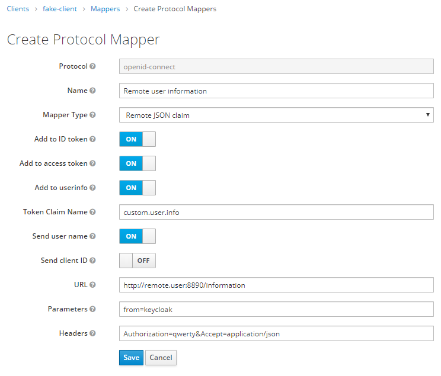
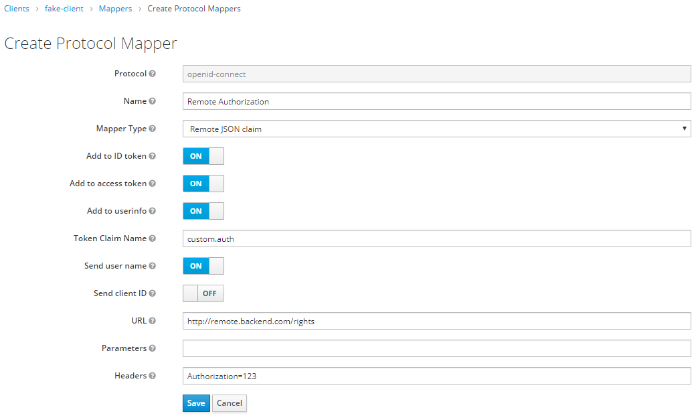

# JSON Remote claim Mapper for Keycloak

This module uses the unoffical Protocol Mapper SPI for keycloak.

It adds a new mapper type which retrieves a JSON claim from a remote HTTP endpoint (e.g. from a REST API). 

## Compatibility

This module currently works with Keycloak Keycloak 8.0.0.

It is compatible with Keycloak >= 4.6.0 , you may just need to change the keycloak version in the ```pom.xml```.

For version <= 4.5.0, the module will also work but a functionnality will be unavailable (see <sup>(1)</sup>).

## Install

Start by building the module:

```Bash
mvn clean package
```

### Deploy manually

1. In keycloak configuration (e.g. standalone.xml), register the module by adding the following provider into the ```urn:jboss:domain:keycloak-server``` subsystem. 
    
        <provider>module:fr.sii.keycloak.mapper.json-remote-claim</provider>

2. Copy Jar and module.xml in the keycloak modules (replace {KEYCLOAK_PATH})

        mkdir -p {KEYCLOAK_PATH}/modules/system/layers/base/fr/sii/keycloak/mapper/json-remote-claim/main/
        cp ./target/json-remote-claim.jar {KEYCLOAK_PATH}/modules/system/layers/base/fr/sii/keycloak/mapper/json-remote-claim/main/
        cp ./src/main/config/module.xml {KEYCLOAK_PATH}/modules/system/layers/base/fr/sii/keycloak/mapper/json-remote-claim/main/

3. Start Keycloak

### Deploy in Docker

To deploy automatically in docker, you can use this solution from Meinert Schwartau:

https://github.com/mschwartau/keycloak-custom-protocol-mapper-example

## Using the module

To add a JSON claim from a remote HTTP / REST service, you just need to add a mapper from client (or client scope) configuration.

You will then be able to:

- Set the URL of the remote service (*URL*)
- Customize the claim path (*Token Claim Name*)
- Send the username as ```username``` query parameter (*Send user name*)
- Send the client_id of the resource as ```client_id``` query parameter (*Send client ID*)
- Add custom  query parameters to the request (*Parameters*)
- Add custom  HTTP headers to the request (*Headers*)

For headers and query parameters, use ```=``` to separate key and value. You can add multiple parameters (and headers) by separating them with ```&```.

### Screenshots





## Functionalities

- Integration as a protocol mapper in Keycloak dashboard
- Configurable claim path (= claim name)
- Handles any type of JSON object
- Sending username as an option
- Sending client_id as an option
- Custom query parameters
- Custom HTTP headers
- URL configuration
- Error handling: no token delivered if claims are unavailable (error 500 will occur)
- <sup>(1)</sup> Optimization when multiple tokens in the response: needs a single request (example: access_token and id_token in the response)

<sup>(1)</sup> *Only with Keycloak >= 4.6.0*